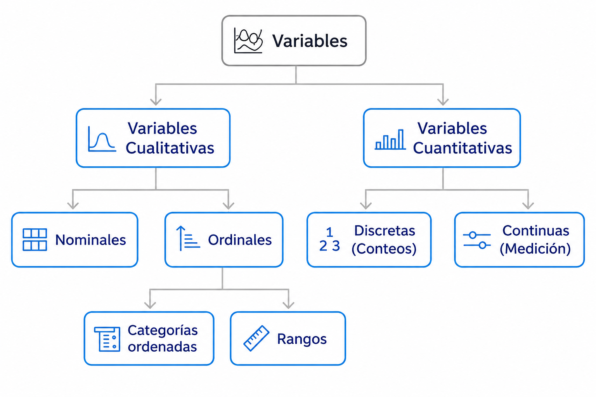
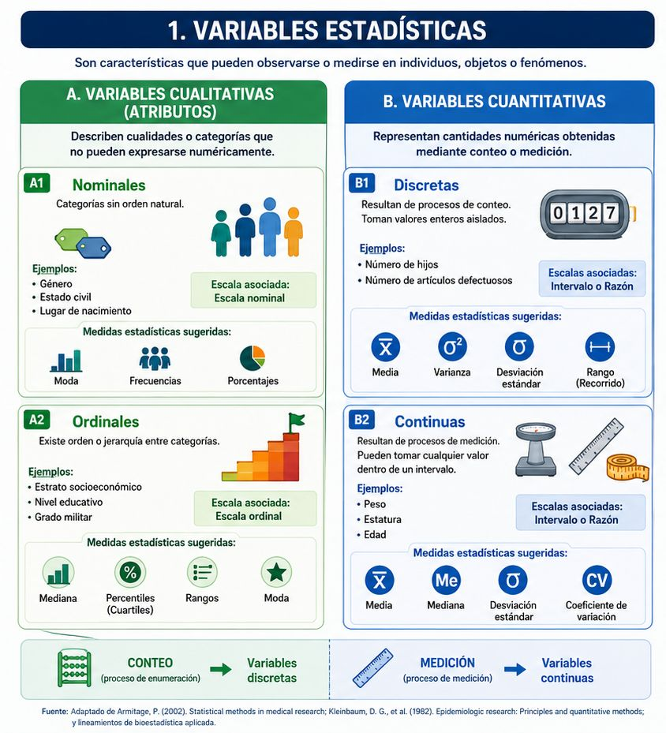
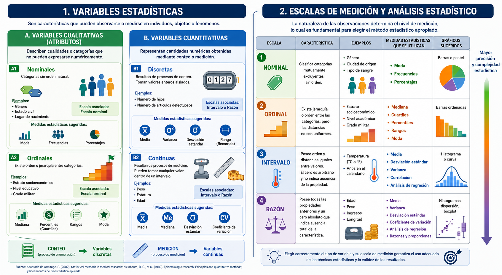

## Introducción

Actualmente los datos se han convertido en un activo fundamental para la toma de decisiones en las empresas, la sociedad, la cademémica entre otros y es por eso que la **estadística descriptiva constituye el primer paso para transformar información en conocimiento útil** [@seoane2007estadistica]. Su aplicación permite un mejor entendimiento del mundo que nos rodea, ya que prácticamente cada aspecto de nuestra existencia es una fuente potencial de datos [@obando2021graficos]. Este capítulo introduce los conceptos básicos necesarios para comprender, organizar y analizar datos, utilizando un enfoque experiencial basado en ejemplos reales y herramientas computacionales como R.

## ¿Qué es la estadística descriptiva?

La **estadística descriptiva** es la rama de la estadística encargada de recolectar, organizar, resumir y presentar datos de manera clara y comprensible .

A diferencia de la estadística inferencial, que busca demostrar asociaciones o hacer comparaciones para extrapolar resultados de una muestra a una población, la descriptiva se limita a **sintetizar la información contenida en los datos recogidos** sin realizar inferencias más allá de la información disponible [@posada2016elementos; @bonita2008epidemiologia].

Su propósito fundamental es facilitar la comprensión de grandes volúmenes de información mediante el uso de **tablas, representaciones gráficas y medidas resumen** (como la media o la desviación estándar), permitiendo "hacerse una idea" de la naturaleza de un conjunto de datos sin tener que analizar cada uno de ellos individualmente [@posada2016elementos; @rey2007introduccion; @spiegel2009estadistica].

## Tipos de variables

Las variables constituyen las características, cualidades o atributos que pueden observarse, clasificarse o medirse en los individuos, objetos o fenómenos de una población o muestra.

Su identificación es fundamental en estadística, ya que permiten describir, analizar e interpretar la información recolectada. Como se observa en la figura, las variables se clasifican en cualitativas y cuantitativas.

Las variables cualitativas describen categorías o atributos y pueden ser nominales u ordinales, mientras que las variables cuantitativas representan cantidades numéricas y se dividen en discretas y continuas según provengan de procesos de conteo o medición. Esta clasificación es esencial porque determina el tipo de análisis estadístico, representación gráfica y medidas descriptivas que pueden aplicarse a los datos.



### Importancia de la identificación de variables estadísticas y escalas de medición

La clasificación de las variables constituye un aspecto esencial en el análisis estadístico, ya que de ella depende la selección de los métodos, procedimientos y representaciones gráficas más adecuados para el tratamiento de los datos. Como se muestra en la figura, las variables cualitativas describen atributos o categorías y suelen analizarse mediante frecuencias, porcentajes y medidas como la moda o la mediana en el caso de variables ordinales.

Por su parte, las variables cuantitativas representan cantidades numéricas derivadas de procesos de conteo o medición, lo que permite aplicar medidas de tendencia central y dispersión, tales como la media, la varianza, la desviación estándar y el coeficiente de variación. En este sentido, identificar correctamente el tipo de variable facilita una interpretación adecuada de la información y garantiza la aplicación de técnicas estadísticas coherentes con la naturaleza de los datos [@armitage2002statistical].



Las **escalas de medición** representan el nivel de información que poseen los datos y constituyen un elemento fundamental en estadística, ya que determinan las operaciones matemáticas y los análisis que pueden realizarse sobre las variables.

Como se observa en la figura, las escalas nominal y ordinal se emplean principalmente en variables cualitativas, mientras que las escalas de intervalo y razón se asocian con variables cuantitativas. A medida que aumenta el nivel de medición, también incrementa la precisión estadística y la complejidad de los métodos analíticos que pueden aplicarse. Por ello, la correcta identificación de la escala permite seleccionar adecuadamente medidas descriptivas, pruebas estadísticas y representaciones gráficas acordes con la naturaleza de los datos.



Las escalas de medición permiten clasificar las variables según el tipo de información que proporcionan. La escala nominal organiza datos en categorías sin orden, por lo que suele analizarse mediante frecuencias y porcentajes. La escala ordinal incorpora jerarquía entre categorías, permitiendo el uso de medidas como mediana, rangos y percentiles. Por su parte, la escala de intervalo presenta distancias iguales entre valores, aunque sin un cero absoluto, lo que posibilita análisis como correlaciones y desviaciones estándar. Finalmente, la escala de razón posee todas las propiedades anteriores y un cero real, permitiendo realizar operaciones matemáticas completas y análisis estadísticos más avanzados. La figura resume las principales características, ejemplos, medidas estadísticas y representaciones gráficas asociadas a cada escala.

La selección de las técnicas estadísticas depende directamente de la escala de medición de las variables. Como se presenta en la figura, las variables medidas en escala nominal suelen representarse mediante gráficos de barras o pastel y analizarse con frecuencias y moda.

Las escalas ordinales permiten incorporar análisis basados en orden y posición, como percentiles o cuartiles. En contraste, las escalas de intervalo y razón posibilitan el cálculo de medidas paramétricas como media, varianza, desviación estándar y análisis de regresión. En consecuencia, conocer la escala de medición garantiza la aplicación de procedimientos estadísticos válidos y una interpretación adecuada de los resultados obtenidos.

La estadística descriptiva permite transformar datos brutos en información significativa mediante el uso de tablas, representaciones gráficas y medidas resumen. Este proceso facilita la organización, interpretación y comprensión de los fenómenos analizados, constituyéndose en una herramienta fundamental para la toma de decisiones basadas en evidencia. Asimismo, la correcta identificación del tipo de variable y de la escala de medición resulta esencial para seleccionar las técnicas estadísticas apropiadas. Un error frecuente consiste en analizar variables ordinales como si fueran cuantitativas continuas o asumir que los datos siguen distribuciones normales sin verificar los supuestos requeridos, lo cual puede afectar la validez de los resultados y conducir a interpretaciones erróneas.

```{r}

#| message: false
#| warning: false

library(readr)
library(dplyr)

# Cargar base de datos de Acuicultura
acuicultura <- read_csv(
  "C:/R-Proyectos/estadistica-experiencial/data/S07D_Acuicultura.csv")

#acuicultura <- read_csv("D:/estadistica-experiencial/data/S07D_Acuicultura.csv")

# Visualizar primeras filas
head(acuicultura)

# Mostrar nombres de variables
names(acuicultura)

# Explorar estructura de la base
glimpse(acuicultura)

# Ver la base completa en RStudio
View(acuicultura)
```

```{r}
#| message: false
#| warning: false

library(readr)
library(dplyr)
library(janitor)

# Cargar base
acuicultura <- read_csv("data/S07D_Acuicultura.csv")

# Ver nombres de variables
names(acuicultura)

# Crear estructura inicial del diccionario
diccionario <- tibble(
  variable = names(acuicultura),
  tipo_dato = sapply(acuicultura, class),
  valores_unicos = sapply(acuicultura, n_distinct),
  missing = sapply(acuicultura, function(x) sum(is.na(x)))
)

# Ver diccionario
diccionario
```

### Ver diccionario de variables en sitio web del DANE [Dicccionario_S07D_Acuicultura](https://microdatos.dane.gov.co/index.php/catalog/513/data-dictionary/F4?file_name=S07D(Acuicultura))

Para exportar el diccionario

```{r}
library(writexl)

write_xlsx(diccionario,
           "data/diccionario_acuicultura.xlsx")
```

Está instrucción permite ver el libro en quarto.

```{r}
#| message: false
#| warning: false
library(gt)

diccionario_acuicultura <- tibble(
  variable = c(
    "TIPO_REG", "PAIS", "P_DEPTO", "P_MUNIC", "UC_UO",
    "ENCUESTA", "COD_VEREDA", "P_S7PNUMPEZ", "P_S7P96",
    "P_S7P97", "P_S7P98", "P_S7P99", "P_S7P100"
  ),
  descripcion = c(
    "Tipo de región",
    "País",
    "Departamento",
    "Municipio",
    "Unidad de cobertura y unidad de observación",
    "Encuesta",
    "Código de vereda",
    "Orden de pez",
    "Nombre de la especie cultivada",
    "Número de cosechas en el año",
    "Número de animales por cosecha",
    "Peso promedio por animal en gramos",
    "Producción total durante 2013 en kilogramos"
  )
)

diccionario_acuicultura |>
  gt()
```

## Actividad experiencial: Explorando una base de datos del DANE

### **Identificación y clasificación de variables estadísticas utilizando datos reales de acuicultura del DANE**

Reconocer y clasificar variables estadísticas presentes en una base de datos del DANE, identificando su naturaleza, escala de medición y posibles análisis estadísticos asociados.

## Contexto de la actividad

En estadística aplicada, antes de realizar cualquier análisis es fundamental comprender las características de las variables contenidas en una base de datos. Para ello, se utilizará una base oficial del Departamento Administrativo Nacional de Estadística (DANE) correspondiente al módulo de acuicultura.

Los estudiantes actuarán como analistas de datos, explorando información real utilizada en estudios productivos y socioeconómicos.

Fuente oficial:

[DANE – Diccionario S07D Acuicultura](https://microdatos.dane.gov.co/index.php/catalog/513/data-dictionary/F4?file_name=S07D(Acuicultura)&utm_source=chatgpt.com)

# Desarrollo de la actividad

## Parte 1. Exploración de la base de datos

### Instrucciones

1.  Cargar la base de datos en R.

2.  Revisar los nombres de las variables.

3.  Consultar el diccionario oficial del DANE.

4.  Identificar:

```         
-   significado de cada variable,

-   tipo de variable,

-   escala de medición,

-   unidad de medida,

-   posible representación gráfica,

-   medidas estadísticas aplicables.
```

```{r}
library(readr)
library(dplyr)

# Cargar base de datos
acuicultura <- read_csv(
  "data/S07D_Acuicultura.csv"
)

# Explorar estructura
names(acuicultura)

glimpse(acuicultura)

head(acuicultura)
```

## Parte 2. Completar la tabla de clasificación

### Instrucciones para el estudiante

Complete la siguiente tabla utilizando:

-   la exploración en R,

-   el diccionario del DANE,

-   los conceptos vistos en clase sobre variables y escalas de medición.

| Variable | Descripción | Tipo de variable | Escala de medición | Unidad de medida | Ejemplo de gráfico | Medidas estadísticas sugeridas |
|-----------|-----------|-----------|-----------|-----------|-----------|-----------|
| `TIPO_REG` |  |  |  |  |  |  |
| `PAIS` |  |  |  |  |  |  |
| `P_DEPTO` |  |  |  |  |  |  |
| `P_MUNIC` |  |  |  |  |  |  |
| `UC_UO` |  |  |  |  |  |  |
| `ENCUESTA` |  |  |  |  |  |  |
| `COD_VEREDA` |  |  |  |  |  |  |
| `P_S7PNUMPEZ` |  |  |  |  |  |  |
| `P_S7P96` |  |  |  |  |  |  |
| `P_S7P97` |  |  |  |  |  |  |
| `P_S7P98` |  |  |  |  |  |  |
| `P_S7P99` |  |  |  |  |  |  |
| `P_S7P100` |  |  |  |  |  |  |

## Parte 3. Interpretación estadística

Responda las siguientes preguntas:

1.  ¿Qué variables son cualitativas y cuáles cuantitativas?

2.  ¿Qué variables corresponden a procesos de conteo?

3.  ¿Qué variables corresponden a procesos de medición?

4.  ¿Cuál variable podría analizarse mediante:

```         
-    histogramas?

-    diagramas de barras?

-   boxplots?
```

5.  ¿Qué variable considera más importante para analizar la producción acuícola y por qué?

Ejemplo de una variable estudiada Curva de densidad de la producción acuícola.

```{r}
#| message: false
#| warning: false
library(ggplot2)

ggplot(
  acuicultura,
  aes(x = log10(P_S7P100 + 1))
) +

  geom_density(
    fill = "skyblue",
    alpha = 0.5,
    color = "blue",
    linewidth = 1
  ) +

  labs(
    title = "Curva de densidad de la producción acuícola",
    subtitle = "Escala logarítmica",
    x = "Log10 Producción total (kg)",
    y = "Densidad"
  ) +

  theme_minimal()
```
