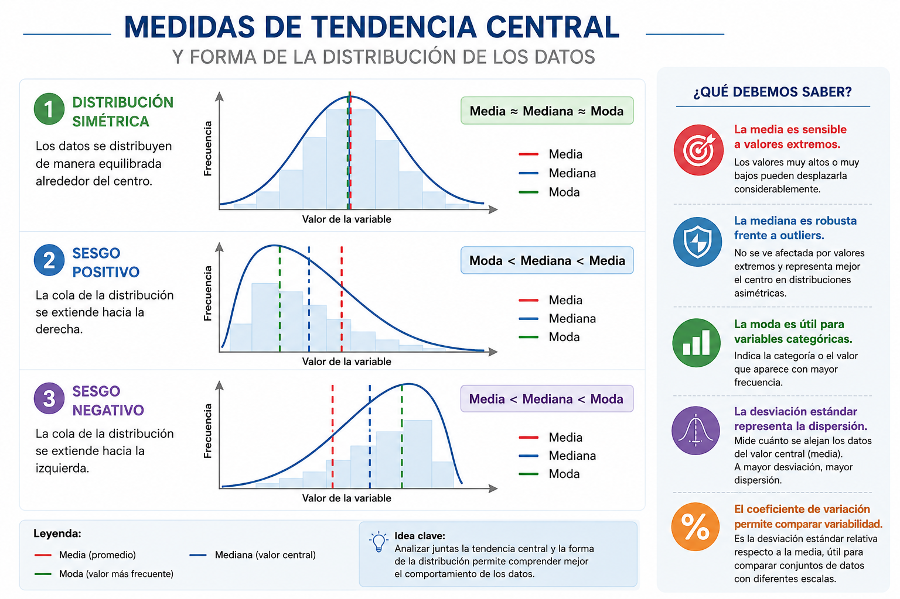

Las medidas de tendencia central son herramientas estadísticas utilizadas para resumir un conjunto de datos mediante un valor representativo o típico. Su principal objetivo es describir el comportamiento general de una distribución y facilitar la comparación entre diferentes conjuntos de información.

En términos generales, una medida de tendencia central representa el punto alrededor del cual tienden a agruparse las observaciones. Estas medidas permiten sintetizar grandes volúmenes de datos en un único valor numérico que describe de manera aproximada el comportamiento de la variable analizada.

Con frecuencia, estas medidas son denominadas “promedios”; sin embargo, cada una posee características particulares y su uso depende de la naturaleza de los datos y del propósito del análisis.

Las tres medidas de tendencia central más utilizadas son:

-   **Media aritmética:** representa el promedio de los valores observados.

-   **Mediana:** corresponde al valor central de los datos ordenados.

-   **Moda:** identifica el valor o categoría que aparece con mayor frecuencia.

La elección de la medida más adecuada depende del tipo de variable, la presencia de valores extremos y la forma de la distribución de los datos. Por ejemplo, la media suele verse afectada por valores atípicos, mientras que la mediana ofrece una medida más robusta en distribuciones asimétricas.

Estas medidas constituyen una base fundamental para el análisis estadístico descriptivo y son ampliamente utilizadas en áreas como la salud, educación, ingeniería, economía y ciencias sociales, ya que permiten resumir información y apoyar la toma de decisiones basada en datos.

En este capítulo se presentan las principales medidas de tendencia central y de dispersión, junto con su formulación matemática y su implementación en R.

# Medidas de tendencia central

### Media aritmética

La media aritmética es el promedio de los datos y se calcula como la suma de todas las observaciones dividida entre el número total de datos.

$$
\bar{x} = \frac{1}{n} \sum_{i=1}^{n} x_i
$$

Donde: $(x_i)$: cada observación, $(n)$: número total de datos, $\bar{x}$: media aritmética\

### Cálculo en R

```{r}
library(readxl)
datos <- read_excel("C:/R-Proyectos/estadistica-experiencial/data/bd_antropometricas.xlsx")
head(datos)
str(datos)
names(datos)
```

```{r}
mean(datos$Peso_Kg, na.rm = TRUE)
```

### Mediana

La mediana es el valor que divide el conjunto de datos ordenados en dos partes iguales, de modo que el 50% de las observaciones queda por debajo y el otro 50% por encima.

$$
\tilde{x} =
\begin{cases}
x_{\frac{n+1}{2}}, & n \text{ impar} \\
\frac{x_{\frac{n}{2}} + x_{\frac{n}{2}+1}}{2}, & n \text{ par}
\end{cases}
$$

La mediana es una medida robusta frente a valores extremos.

### Cálculo en R

```{r}
median(datos$Peso_Kg, na.rm = TRUE)
```

### Moda

La moda es el valor que aparece con mayor frecuencia en el conjunto de datos.

$$
\text{Moda} = \arg\max (f_i)
$$

### Cálculo en R

```{r}
moda <- function(x) {
  ux <- unique(x)
  ux[which.max(tabulate(match(x, ux)))]
}

moda(datos$Peso_Kg)
```

## Visualización de las medidas de tendencia central

```{r}
library(readxl)
library(ggplot2)

# Cargar datos
datos <- read_excel(
  "C:/R-Proyectos/estadistica-experiencial/data/bd_antropometricas.xlsx"
)

# Función para calcular la moda
moda <- function(x) {
  x <- na.omit(x)
  ux <- unique(x)
  ux[which.max(tabulate(match(x, ux)))]
}

# Medidas de tendencia central
media <- mean(datos$Peso_Kg, na.rm = TRUE)
mediana <- median(datos$Peso_Kg, na.rm = TRUE)
moda_val <- moda(datos$Peso_Kg)

# Histograma
ggplot(datos, aes(x = Peso_Kg)) +
  
  geom_histogram(
    bins = 10,
    fill = "skyblue",
    color = "black",
    alpha = 0.7
  ) +
  
  # Media
  geom_vline(
    xintercept = media,
    color = "red",
    linewidth = 1.2,
    linetype = "dashed"
  ) +
  
  # Mediana
  geom_vline(
    xintercept = mediana,
    color = "blue",
    linewidth = 1.2
  ) +
  
  # Moda
  geom_vline(
    xintercept = moda_val,
    color = "darkgreen",
    linewidth = 1.2,
    linetype = "dotdash"
  ) +
  
  labs(
    title = "Distribución del peso",
    subtitle = "Media (rojo), Mediana (azul) y Moda (verde)",
    x = "Peso (kg)",
    y = "Frecuencia"
  ) +
  
  theme_minimal()
```

## Interpretación del gráfico: Distribución del peso

El histograma presenta la distribución de la variable **Peso (kg)** en la muestra analizada, incorporando las tres principales medidas de tendencia central:

🔴 **Media** (línea roja) 🔵 **Mediana** (línea azul) 🟢 **Moda** (línea verde)

### Análisis estadístico

**La media es mayor que la mediana y la moda**

Se observa que: $Media > Mediana>Moda$. Esto indica una **asimetría positiva** o sesgo hacia la derecha.

**Existencia de valores extremos**

La presencia de individuos con pesos altos (aproximadamente entre 140 y 190 kg) desplaza la media hacia valores mayores. Estos datos atípicos afectan principalmente la media, mientras que la mediana permanece más estable.

**Concentración principal de los datos**

La mayor frecuencia de observaciones se concentra entre aproximadamente **35 y 65 kg**, lo que indica que la mayoría de los participantes presentan pesos dentro de ese intervalo.

**Comportamiento de la moda**

La moda se ubica en el intervalo de mayor frecuencia, representando el peso más común dentro de la muestra.

# Ejercicio experiencial propuesto

## Actividad: Explorando las características antropométricas

### Objetivo

Analizar diferentes variables antropométricas mediante histogramas y medidas de tendencia central para identificar patrones de distribución, variabilidad y posibles valores atípicos.

| Variable             | Interpretación                |
|----------------------|-------------------------------|
| `Altura_cm`          | Distribución de estaturas     |
| `Anchura_hombros_cm` | Variabilidad corporal         |
| `Long_Brazo_cm`      | Proporciones anatómicas       |
| `Long_Muslo_cm`      | Longitud del miembro inferior |
| `Long_Antebrazo_cm`  | Variabilidad segmentaria      |

## Actividad práctica

## Parte 1. Construcción del gráfico

Construya un histograma para cada una de las siguientes variables:

-   Altura_cm

-   Anchura_hombros_cm

-   Long_Brazo_cm

Incluya mediante líneas verticales de diferentes colores.

-   Media, Mediana, Moda

## Parte 2. Interpretación

Para cada gráfico responda:

1.  ¿La distribución parece simétrica o asimétrica?

2.  ¿Existen valores extremos?

3.  ¿La media y la mediana son similares?

4.  ¿Qué medida representa mejor el comportamiento de los datos?

5.  ¿Cuál variable presenta mayor dispersión?

# Medidas de dispersión o variabilidad

Las medidas de dispersión o variabilidad complementan a las medidas de tendencia central, ya que permiten describir qué tan agrupados o dispersos se encuentran los datos respecto a un valor representativo, como la media o la mediana.

Mientras que las medidas de tendencia central resumen la distribución mediante un único valor típico, las medidas de dispersión indican el grado de heterogeneidad presente en los datos. En consecuencia, dos conjuntos de datos pueden tener la misma media, pero comportamientos muy diferentes en cuanto a su variabilidad.

Por ejemplo, un grupo de observaciones puede presentar valores muy cercanos entre sí y concentrados alrededor de la media, mientras que otro grupo puede mostrar valores mucho más dispersos. Aunque ambos conjuntos tengan el mismo promedio, el segundo exhibirá mayor variabilidad.

La variabilidad constituye un aspecto fundamental en el análisis estadístico, ya que permite evaluar la estabilidad, consistencia y homogeneidad de los datos. En muchos contextos aplicados, comprender la dispersión resulta tan importante como conocer el promedio.

### Rango

El rango es la diferencia entre el valor máximo y el mínimo.

$$
R = X_{\max} - X_{\min}
$$

### Cálculo en R

```{r}
max(datos$Peso_Kg, na.rm = TRUE) - min(datos$Peso_Kg, na.rm = TRUE)
```

### Varianza muestral

La varianza mide la dispersión promedio de los datos respecto a la media.

$$
s^2 = \frac{1}{n - 1} \sum_{i=1}^{n} (x_i - \bar{x})^2
$$

### Cálculo en R

```{r}
var(datos$Peso_Kg, na.rm = TRUE)
```

### Varianza poblacional

$$
\sigma^2 = \frac{1}{N} \sum_{i=1}^{N} (x_i - \mu)^2
$$

### Desviación estándar muestral

La desviación estándar es la raíz cuadrada de la varianza y expresa la dispersión en las mismas unidades de los datos.

$$
s = \sqrt{s^2}
$$

### Cálculo en R

```{r}
sd(datos$Peso_Kg, na.rm = TRUE)
```

### Desviación estándar poblacional

$$
\sigma = \sqrt{\sigma^2}
$$

### Coeficiente de variación

El coeficiente de variación permite comparar la dispersión relativa respecto a la media.

$$
CV = \frac{s}{\bar{x}} \times 100
$$

### Cálculo en R

```{r}
(sd(datos$Peso_Kg, na.rm = TRUE) / mean(datos$Peso_Kg, na.rm = TRUE)) * 100
```

## Resumen estadístico en R

R permite obtener múltiples medidas descriptivas de manera simultánea.

```{r}
summary(datos$Peso_Kg)
```

También es posible calcular varias medidas en conjunto:

```{r}
library(summarytools)
descr(datos,stats=c("mean","sd","q1","med","q3","min","max","cv"))
```

## Histograma + desviación estándar

```{r}
media <- mean(datos$Peso_Kg, na.rm = TRUE)
desv <- sd(datos$Peso_Kg, na.rm = TRUE)

ggplot(datos, aes(x = Peso_Kg)) +
  
  geom_histogram(
    bins = 10,
    fill = "skyblue",
    color = "black"
  ) +
  
  # Media
  geom_vline(
    xintercept = media,
    color = "red",
    linewidth = 1.2
  ) +
  
  # ±1 desviación estándar
  geom_vline(
    xintercept = media + desv,
    color = "darkgreen",
    linetype = "dashed",
    linewidth = 1
  ) +
  
  geom_vline(
    xintercept = media - desv,
    color = "darkgreen",
    linetype = "dashed",
    linewidth = 1
  ) +
  
  labs(
    title = "Distribución del peso y desviación estándar",
    subtitle = "Línea roja = media | Líneas verdes = ±1 desviación estándar",
    x = "Peso (kg)",
    y = "Frecuencia"
  ) +
  
  theme_minimal()

```

### Interpretación

El histograma del peso complementado con la media y la desviación estándar permite analizar tanto la tendencia central como la variabilidad de los datos. La línea roja representa la media del peso de los participantes, mientras que las líneas verdes discontinuas indican un intervalo aproximado de una desviación estándar por encima y por debajo de la media. Este intervalo permite identificar el rango donde se concentra gran parte de las observaciones.

En la distribución analizada se observa que la mayoría de los individuos presentan pesos cercanos a la media, concentrándose principalmente dentro del intervalo delimitado por las líneas de desviación estándar. Sin embargo, también se identifican algunos valores alejados del centro de la distribución, lo que sugiere la presencia de posibles valores atípicos o una dispersión considerable en ciertos casos. Desde el punto de vista estadístico, una desviación estándar pequeña indica que los datos son más homogéneos y se agrupan cerca de la media; por el contrario, una desviación estándar grande refleja una mayor heterogeneidad y dispersión de los datos.

## Comparar dispersión entre géneros

```{r}
ggplot(datos, aes(x = Peso_Kg)) +
  
  geom_density(
    fill = "lightgreen",
    alpha = 0.5
  ) +
  
  labs(
    title = "Densidad del peso",
    subtitle = "Visualización de la dispersión de los datos",
    x = "Peso (kg)",
    y = "Densidad"
  ) +
  
  theme_classic()

```

### Interpretación

La curva de densidad representa una versión suavizada de la distribución de los datos y permite visualizar la concentración de observaciones a lo largo de los valores de la variable peso.

Las zonas más altas de la curva indican intervalos donde existe una mayor concentración de individuos, mientras que las áreas más bajas representan valores menos frecuentes. La forma de la curva permite evaluar características importantes de la distribución, tales como: simetría; presencia de sesgo; concentración de datos; posibles agrupamientos y dispersión general.

Si la curva presenta una forma aproximadamente simétrica, puede inferirse que los datos tienden a distribuirse de manera equilibrada alrededor de la media. En cambio, una cola más larga hacia alguno de los extremos indica asimetría o sesgo en la distribución.

Asimismo, una curva más ancha y extendida refleja mayor dispersión de los datos, mientras que una curva más estrecha indica mayor homogeneidad. La curva de densidad constituye una herramienta útil para comprender visualmente la estructura de la distribución y complementar el análisis realizado mediante histogramas y medidas descriptivas.

```{r}
ggplot(datos, aes(x = Genero, y = Peso_Kg, fill = Genero)) +
  
  geom_violin(alpha = 0.7) +
  
  geom_boxplot(
    width = 0.1,
    fill = "white"
  ) +
  
  labs(
    title = "Distribución y dispersión del peso",
    x = "Género",
    y = "Peso (kg)"
  ) +
  
  theme_minimal()
```

### Interpretación

El boxplot comparativo del peso según género permite evaluar diferencias en la tendencia central y la dispersión entre los grupos analizados. Cada caja representa el rango intercuartílico de los datos, es decir, el intervalo donde se concentra el 50 % central de las observaciones. La línea ubicada dentro de la caja corresponde a la mediana, mientras que los puntos alejados representan posibles valores atípicos.

A partir de la gráfica es posible identificar: diferencias en la mediana del peso entre géneros; variaciones en la amplitud de las cajas, asociadas al grado de dispersión; presencia de valores extremos; diferencias en la homogeneidad de los grupos.

Un grupo con cajas más amplias y bigotes más extensos presenta mayor variabilidad, indicando que los valores se encuentran más dispersos. Por el contrario, cajas más compactas sugieren una distribución más homogénea. Este tipo de análisis resulta especialmente útil para comparar poblaciones y explorar patrones de comportamiento de variables antropométricas en distintos grupos.

## Resumen gráfico

Las medidas de tendencia central y dispersión son esenciales para describir un conjunto de datos. Su correcta interpretación permite comprender la estructura de la información, identificar patrones y apoyar la toma de decisiones basada en evidencia. En R, estas medidas pueden calcularse de forma sencilla, lo que facilita su aplicación en análisis estadísticos tanto exploratorios como inferenciales.


