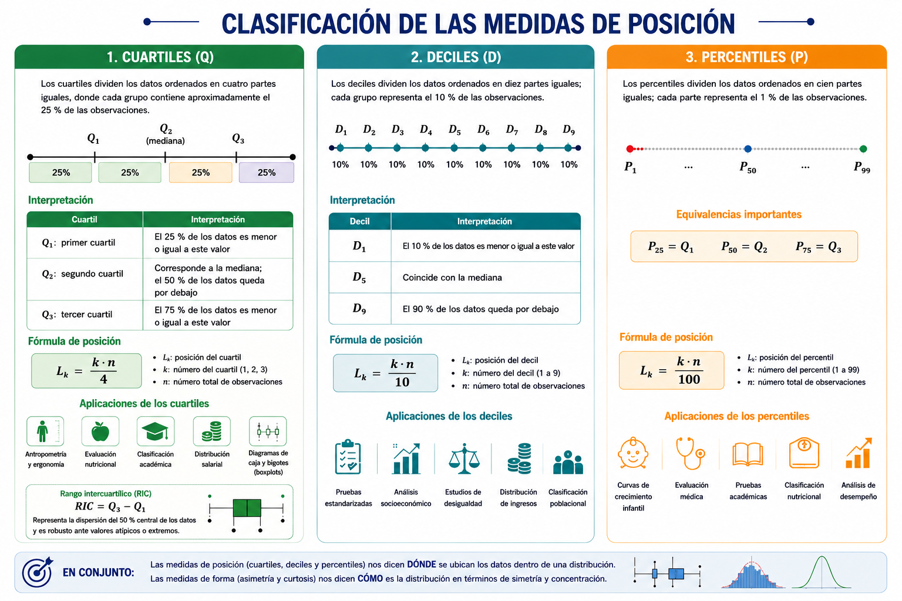
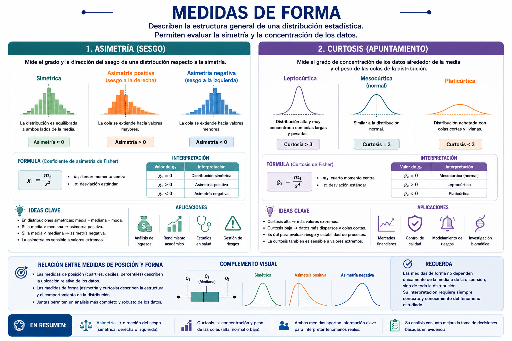

Las medidas de posición y forma constituyen herramientas fundamentales
de la estadística descriptiva, ya que permiten profundizar en la
comprensión del comportamiento de una distribución de datos más allá de
los valores centrales. Mientras las medidas de posición, como los
cuartiles, deciles y percentiles, permiten determinar la ubicación
relativa de una observación dentro de un conjunto ordenado de datos, las
medidas de forma describen características estructurales de la
distribución, tales como la simetría y el grado de concentración de las
observaciones alrededor de la media.

El estudio conjunto de estas medidas facilita una interpretación más
completa de los fenómenos analizados, permitiendo identificar patrones,
desigualdades, concentraciones, sesgos y posibles valores extremos.
Asimismo, conceptos asociados como el rango intercuartílico, los
diagramas de caja y bigotes (boxplots), las curvas percentilares y los
histogramas complementan el análisis estadístico mediante
representaciones visuales que favorecen la interpretación de los datos.

Estas herramientas poseen amplias aplicaciones en contextos reales como
el análisis del rendimiento académico, la clasificación de riesgo, la
distribución salarial, los estudios antropométricos y las evaluaciones
en salud pública, donde resulta esencial comprender no solo el valor
promedio de una variable, sino también la posición relativa y la forma
general de su distribución.

# Medidas de posición

Las medidas de posición son indicadores estadísticos que permiten
determinar la ubicación relativa de un valor dentro de un conjunto de
datos ordenados. Estas medidas dividen la distribución en partes iguales
y permiten identificar qué proporción de las observaciones se encuentra
por debajo o por encima de un determinado valor.

A diferencia de las medidas de tendencia central, cuyo propósito es
resumir el comportamiento típico de los datos mediante un único valor
representativo, las medidas de posición permiten describir la
distribución desde una perspectiva relativa o acumulativa.

Por ejemplo:

-   ¿Qué valor deja por debajo al 25 % de las observaciones?

-   ¿Cuál es el punto que supera el 90 % de la población?

-   ¿En qué posición relativa se encuentra un estudiante respecto a sus
    compañeros?

    Estas preguntas pueden responderse mediante cuartiles, deciles y
    percentiles.

## Clasificación de las medidas de posición

Las principales medidas de posición son:

| Medida      | División de los datos |
|-------------|-----------------------|
| Cuartiles   | 4 partes iguales      |
| Deciles     | 10 partes iguales     |
| Percentiles | 100 partes iguales    |

Todas comparten la misma lógica matemática:

1.  ordenar los datos;

2.  calcular una posición;

3.  identificar el valor correspondiente dentro de la distribución.

# Cuartiles

Los cuartiles son medidas de posición que dividen un conjunto de datos
ordenados en cuatro partes iguales, de tal manera que cada grupo
contiene aproximadamente el 25 % de las observaciones. Se representan
mediante:

| Cuartil | Interpretación |
|------------------|------------------------------------------------------|
| $Q_1$: primer cuartil | El 25 % de los datos es menor o igual a este valor |
| $Q_2$: segundo cuartil | Corresponde a la mediana; el 50 % de los datos queda por debajo |
| $Q_3$: tercer cuartil | El 75 % de los datos es menor o igual a este valor |

## Fórmula de posición

La posición del cuartil se calcula mediante:

$L_k = \frac{k\cdot n}{4}$​

donde:

-   $L_k$: posición del cuartil,

-   $k$: número del cuartil,

-   $n$: número total de observaciones.

Los cuartiles poseen amplias aplicaciones en diferentes áreas del
conocimiento, debido a que permiten dividir una distribución de datos en
cuatro partes iguales y analizar la posición relativa de las
observaciones dentro de un conjunto ordenado. En estudios
antropométricos y ergonómicos, por ejemplo, los cuartiles se utilizan
para diseñar mobiliario y espacios adaptados a las características
físicas de la población. De igual manera, en evaluación nutricional
permiten clasificar individuos según variables como peso, talla o índice
de masa corporal.

En el ámbito educativo, los cuartiles facilitan la clasificación
académica y la comparación del desempeño relativo de los estudiantes
dentro de un grupo. Asimismo, en economía y ciencias sociales son
empleados para estudiar la distribución salarial y analizar
desigualdades entre diferentes segmentos de la población.

Los cuartiles también constituyen la base de los diagramas de caja y
bigotes (boxplots), una representación gráfica ampliamente utilizada
para visualizar la distribución de los datos, identificar valores
extremos y evaluar la variabilidad de una muestra.

A partir de los cuartiles puede calcularse el rango intercuartílico
(RIC), definido como la diferencia entre el tercer y el primer cuartil:

$RIC = Q_3 - Q_1$​

Esta medida representa la dispersión del 50 % central de los datos y
resulta especialmente útil porque no se ve afectada significativamente
por valores atípicos o extremos.

# Deciles

Los deciles son medidas de posición que dividen un conjunto de datos
ordenados en diez partes iguales, de manera que cada grupo representa el
10 % de las observaciones. Se denotan como:

| Decil | Interpretación                                     |
|-------|----------------------------------------------------|
| $D_1$​ | El 10 % de los datos es menor o igual a este valor |
| $D_5$ | Coincide con la mediana                            |
| $D_9$ | El 90 % de los datos queda por debajo              |

## Fórmula de posición

$L_k = \frac{k\cdot n}{10}$​

## Aplicaciones de los deciles

Los deciles se utilizan frecuentemente en:

-   pruebas estandarizadas,

-   análisis socioeconómico,

-   estudios de desigualdad,

-   distribución de ingresos,

-   clasificación poblacional.

# Percentiles

Los percentiles son medidas de posición que dividen un conjunto de datos
ordenados en cien partes iguales, donde cada parte representa el 1 % de
las observaciones. Se representan mediante:
$P_1, P_2, P_3, \dots, P_{99}$. El percentil$P_k$ indica que el $k\%$ de
las observaciones es menor o igual a dicho valor. Por ejemplo:

-   $P_{25} = Q_1$

-   $P_{50} = Q_2$

-   $P_{75} = Q_3$

## Fórmula de posición

$L_k = \frac{k\cdot n}{100}$

## Aplicaciones de los percentiles

Los percentiles son fundamentales en curvas de crecimiento infantil,
evaluación médica, pruebas académicas, clasificación nutricional,
análisis de desempeño, entre otras.

# Medidas de forma

Las medidas de forma permiten describir la estructura general de una
distribución estadística, evaluando características como: simetría,
concentración, colas extremas, comportamiento alrededor de la media. Las
principales medidas de forma son: asimetría y curtosis.

## Asimetría

La asimetría evalúa el grado de sesgo de una distribución.

| Tipo               | Característica            |
|--------------------|---------------------------|
| Simétrica          | Ambos lados son similares |
| Asimetría positiva | Cola hacia la derecha     |
| Asimetría negativa | Cola hacia la izquierda   |

## Curtosis

La curtosis describe el grado de concentración de los datos alrededor de
la media.

| Tipo         | Característica                  |
|--------------|---------------------------------|
| Leptocúrtica | Distribución alta y concentrada |
| Mesocúrtica  | Similar a distribución normal   |
| Platicúrtica | Distribución achatada           |

