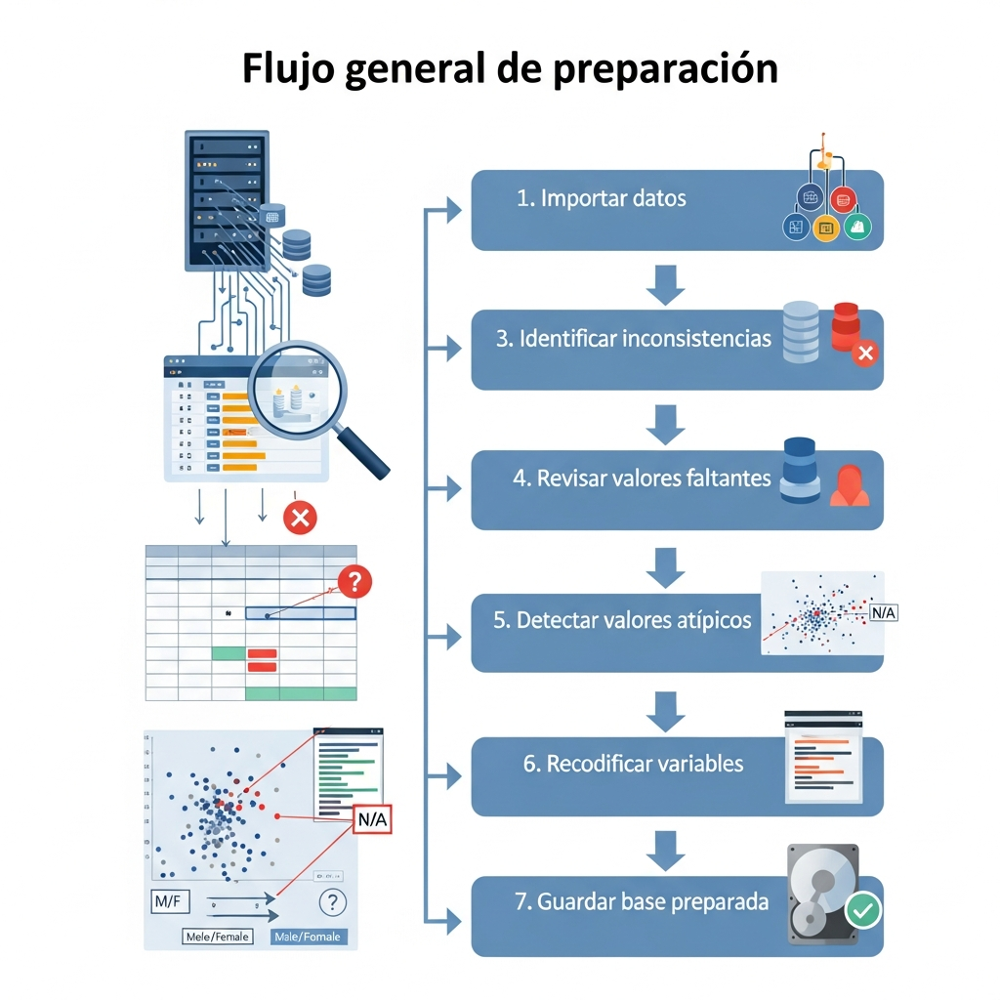

La preparación de datos es la etapa inicial del análisis estadístico en la que se revisa, organiza, limpia y transforma la información disponible antes de aplicar técnicas descriptivas o inferenciales. El flujo de trabajo se muestra en la @fig-flujo. Su propósito es garantizar que los datos sean coherentes, completos y adecuados para responder una pregunta de análisis[@kleinbaum2012survival; @wickham2017r, @hair2019multivariate].

Al finalizar este capítulo, el estudiante estará en capacidad de importar bases de datos en R, explorar su estructura, identificar valores faltantes, reconocer inconsistencias, recodificar variables y preparar una base limpia para el análisis estadístico.

{#fig-flujo}

## Carga de datos en R

Para favorecer la reproducibilidad, en este libro los archivos se referencian mediante **rutas relativas al proyecto**. Por ejemplo, una base almacenada en la carpeta `data` se importa como `data/archivo.csv`. De esta manera, no es necesario escribir rutas vinculadas a un computador específico ni utilizar `setwd()` en cada capítulo. La configuración de Quarto establece el directorio del proyecto como punto de ejecución común. Existen múltiples métodos para cargar datos dependiendo de su formato:

::: {#tbl-variables tbl-cap="Métodos de carga de datos en R"}
| Método | Característica | Ejemplo |
|------------------------|------------------------|------------------------|
| Archivos de texto y CSV | Uso de funciones como `read.csv()` o `read.csv2()`, especificando encabezados y codificación | Importación de archivos `.csv` |
| Interfaces gráficas (GUI) | Herramientas como R Commander permiten importar datos sin necesidad de programación | Importación desde Excel, SPSS, STATA |
| Minería de datos | Paquetes como `rattle` permiten cargar datos mediante interfaces visuales configurables | Definición de separadores y decimales |
:::

## Limpieza de datos

La limpieza de datos consiste en detectar, corregir o eliminar inconsistencias que puedan afectar la validez del análisis estadístico [@vandenbroeck2005datacleaning]. Un paso inicial es la inspección visual del conjunto de datos para identificar registros incompletos, errores de digitación o valores atípicos. Por ejemplo, líneas que contienen exclusivamente valores faltantes (`NA`) deben ser evaluadas antes de su inclusión en el análisis.

::: {#tbl-preparacion-datos tbl-cap="Aspectos clave en la preparación de datos"}
| Proceso | Subproceso | Descripción | Herramienta / Ejemplo |
|------------------|------------------|------------------|------------------|
| **Limpieza de datos** | Valores extremos (Outliers) | Identificación y tratamiento de datos atípicos que pueden distorsionar resultados. Se recomienda corregir o eliminar errores evidentes. | Diagramas de caja (*boxplot*) [@tukey1977eda] |
|  | Consistencia de totales | Verificación de coherencia entre frecuencias, totales y porcentajes acumulados. | Validación de sumas [@agresti2018statistical] |
|  | Filtrado de datos | Selección de subconjuntos de datos según criterios específicos para análisis focalizado. | Filtrado en R (`subset`, `filter`) |
| **Valores faltantes** | Identificación y codificación | Asignación de códigos (ej: 99, 999) para identificar datos perdidos. | Codificación en R o SPSS |
|  | Eliminación de casos | Eliminación de registros incompletos antes del análisis. | `na.omit()`, `na.exclude()` |
|  | Imputación | Estimación de valores faltantes mediante métodos estadísticos. | Métodos de imputación |
|  | Análisis de censura | Tratamiento de datos incompletos en estudios de supervivencia. | [@kleinbaum2012survival] |
| **Recodificación** | Categorización de variables | Transformación de variables cuantitativas en categorías. | Agrupación de edades |
|  | Codificación de atributos | Asignación de valores numéricos a variables cualitativas. | 1 = Masculino, 2 = Femenino |
|  | Variables dummy | Conversión de variables categóricas en variables binarias. | [@wooldridge2016econometrics] |
|  | Tratamiento de etiquetas | Conversión de códigos numéricos a etiquetas descriptivas. | `factor()` en R |
:::

La preparación de datos es una etapa esencial para garantizar la calidad del análisis estadístico. Antes de calcular indicadores o construir gráficos, es necesario comprender la estructura de la base, revisar inconsistencias, identificar valores faltantes y transformar las variables cuando sea necesario. Un análisis confiable comienza con datos bien preparados .
