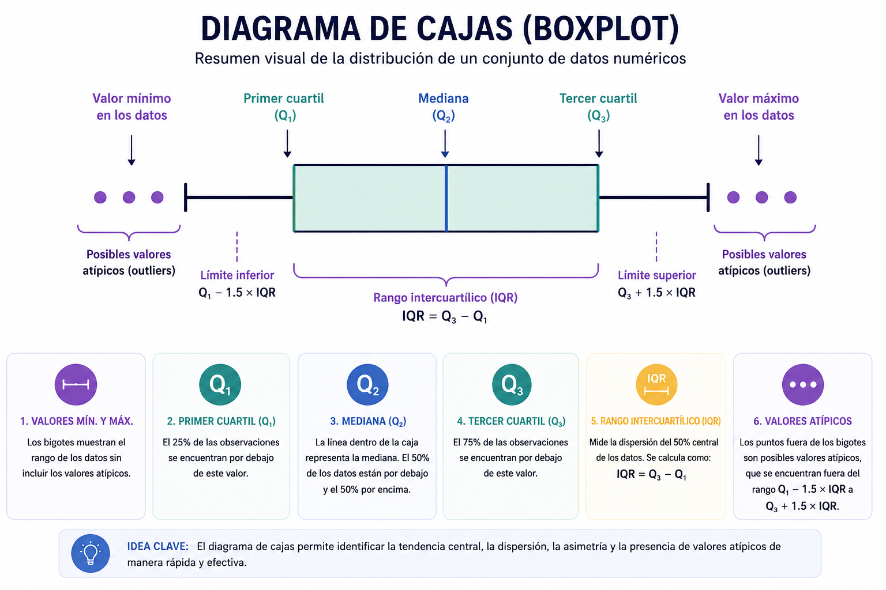

La visualización de datos es una etapa fundamental en la estadística descriptiva, ya que permite representar la información de forma clara, resumida e interpretable. Los gráficos facilitan la identificación de patrones, tendencias, valores atípicos y diferencias entre grupos, apoyando así la comprensión de los datos y la toma de decisiones (@fig-resumengraficos).

{#fig-resumengraficos}

En este capítulo se presentan algunos de los gráficos más utilizados en el análisis descriptivo: gráficos de barras, histogramas y diagramas de caja (*boxplot*), así como su construcción en R.

## Gráficos en R

R es un lenguaje ampliamente utilizado para el análisis estadístico y la visualización de datos. Permite elaborar gráficos tanto con funciones básicas como con paquetes especializados, entre ellos `ggplot2`, que ofrece una sintaxis más flexible y una presentación más profesional.

::: callout-note
## De R base a `ggplot2`

Algunos ejemplos presentan primero una función gráfica de R base para reconocer la relación directa entre una variable y su representación. Posteriormente se utiliza `ggplot2` para construir visualizaciones con mayor control sobre capas, etiquetas y diseño. Esta transición es intencional: permite distinguir el **concepto estadístico** de la **herramienta gráfica** empleada para comunicarlo.
:::

Para los ejemplos de este capítulo se utilizarán las librerías `readxl` y `ggplot2`.

```{r}
library(readxl)
datos <- read_excel("data/bd_antropometricas.xlsx")
head(datos)
str(datos)
```

## Gráfico de sectores

El gráfico de pastel es una representación estadística utilizada para mostrar la distribución porcentual de una variable cualitativa. Cada sector del círculo representa una categoría y su tamaño es proporcional a la frecuencia relativa o porcentaje que dicha categoría aporta al total de observaciones.

```{r}
library(readxl)
library(dplyr)
library(ggplot2)
library(scales)

# Cargar base antropométrica
datos <- read_excel(
  "data/bd_antropometricas.xlsx"
)

# Tabla de proporciones por género
tabla_genero <- datos %>%
  count(Genero) %>%
  mutate(
    proporcion = n / sum(n),
    porcentaje = percent(proporcion, accuracy = 0.1),
    etiqueta = paste0(Genero, "\n", porcentaje)
  )

# Gráfico de pastel
ggplot(
  tabla_genero,
  aes(
    x = "",
    y = proporcion,
    fill = Genero
  )
) +
  geom_col(
    width = 1,
    color = "white"
  ) +
  coord_polar(theta = "y") +
  geom_text(
    aes(label = etiqueta),
    position = position_stack(vjust = 0.5),
    size = 4
  ) +
  labs(
    title = "Distribución porcentual de estudiantes según género",
    fill = "Género"
  ) +
  theme_void()
```

**Interpretación de la gráfica:** La gráfica evidencia que el 80% de los estudiantes registrados en la base de datos corresponde al género femenino (F), mientras que el 20% pertenece al género masculino (M). Esto indica una marcada predominancia de mujeres dentro de la muestra analizada.

Este tipo de representación facilita la comparación visual de proporciones entre categorías y permite identificar rápidamente la participación relativa de cada grupo dentro del conjunto de datos.

## Gráfico de barras

El gráfico de barras se utiliza principalmente para representar variables cualitativas o categóricas. Su finalidad es mostrar la frecuencia o proporción de cada categoría mediante barras separadas, cuya altura es proporcional a la cantidad observada.

Por ejemplo, si se desea visualizar la distribución de una variable como el género o la clase, puede emplearse un gráfico de barras.

```{r}
library(readxl)
library(dplyr)
library(ggplot2)

datos <- read_excel(
  "data/bd_antropometricas.xlsx"
)

# Gráfico de barras para Género
datos %>%
  count(Grupo) %>%
  ggplot(aes(x = Grupo, y = n)) +
  geom_col(fill = "#1F77B4", color = "white") +
  geom_text(
    aes(label = n),
    vjust = -0.4,
    size = 4
  ) +
  labs(
    title = "Distribución de estudiantes según grupo",
    x = "Grupo",
    y = "Frecuencia"
  ) +
  theme_minimal(base_size = 14)
```

```{r}
library(readxl)
library(dplyr)
library(ggplot2)
library(scales)

datos <- read_excel(
  "data/bd_antropometricas.xlsx"
)

# Calcular proporciones por grupo
tabla_grupo <- datos %>%
  
  count(Grupo) %>%
  
  mutate(
    proporcion = n / sum(n)
  )

# Gráfico de barras con proporciones
ggplot(
  tabla_grupo,
  aes(x = Grupo, y = proporcion)
) +
  
  geom_col(
    fill = "#1F77B4",
    color = "white"
  ) +
  
  geom_text(
    aes(
      label = percent(proporcion)
    ),
    
    vjust = -0.4,
    size = 5
  ) +
  
  scale_y_continuous(
    labels = percent_format()
  ) +
  
  labs(
    title = "Proporción de estudiantes según grupo",
    x = "Grupo",
    y = "Proporción"
  ) +
  
  theme_minimal(base_size = 12)
```

**Interpretación:** El gráfico de proporciones permite identificar la participación relativa de cada grupo dentro del total de estudiantes analizados. A diferencia de las frecuencias absolutas, las proporciones facilitan la comparación entre categorías y permiten interpretar la distribución porcentual de la muestra.

## Histograma

El histograma se utiliza para representar la distribución de una variable cuantitativa continua. A diferencia del gráfico de barras, en el histograma las barras se presentan unidas, ya que representan intervalos de clase contiguos.

Este tipo de gráfico es útil para identificar la forma de la distribución, la concentración de valores, posibles asimetrías y presencia de valores extremos.

### Ejemplo con funciones básicas de R

```{r}
library(readr)
library(dplyr)

# Cargar base de datos de Acuicultura
acuicultura <- read_csv(
  "data/S07D_Acuicultura.csv")

#Número de cosechas en el año (P_S7P97)
#archivo de datos: S07D(Acuicultura)

names(acuicultura)

hist(acuicultura$P_S7P97,
     main = "Número de cosechas en el año (P_S7P97)",
     xlab = "Cosechas",
     ylab = "Frecuencia")
```

## Boxplot

El diagrama de caja y bigotes, o *boxplot*, es un gráfico que resume la distribución de una variable cuantitativa a partir de los cuartiles, la mediana y los valores extremos (@fig-boxplot). Es especialmente útil para detectar asimetrías y observaciones atípicas. El boxplot se basa en el resumen de cinco números:

{#fig-boxplot}

### Ejemplo con funciones básicas de R

```{r}
library(readr)
library(ggplot2)

# Cargar base de datos
acuicultura <- read_csv(
  "data/S07D_Acuicultura.csv"
)

# Boxplot
ggplot(
  acuicultura,
  
  aes(x = P_S7P97)
) +
  
  geom_boxplot(
    
    fill = "#2C7FB8",
    
    color = "black",
    
    alpha = 0.9,
    
    outlier.color = "red"
  ) +
  
  labs(
    title = "Distribución del número de cosechas",
    
    x = "Número de cosechas",
    
    y = ""
  ) +
  
  theme_minimal()
```

**Interpretación:** El boxplot evidencia que la mayor parte de las unidades productivas presentan un número bajo de cosechas, concentrándose principalmente entre 1 y 2 cosechas. La línea de la mediana se encuentra muy cercana al primer cuartil (Q1), lo cual sugiere una distribución asimétrica positiva, donde los valores altos son menos frecuentes pero considerablemente más dispersos.

Además, se observan múltiples valores atípicos hacia la derecha del gráfico, indicando la existencia de algunas unidades productivas con un número de cosechas significativamente superior al comportamiento general de la muestra. Esto evidencia una alta heterogeneidad en los datos y una posible concentración de productores con niveles excepcionales de producción.

El reducido tamaño de la caja refleja que el 50% central de las observaciones se encuentra en un rango estrecho, mientras que la presencia de valores extremos amplía considerablemente el rango total de la distribución.

### Ejemplo peso y género con `ggplot2`

También es posible comparar una variable cuantitativa entre categorías.

```{r}
ggplot(datos, aes(x = Genero, y = Peso_Kg)) +
  geom_boxplot() +
  labs(
    title = "Distribución del peso según género",
    x = "Género",
    y = "Peso"
  )
```

**Interpretación:** el boxplot evidencia diferencias en la distribución del peso corporal según el género. En los hombres (M) se observa una mediana de peso superior y una mayor dispersión de los datos en comparación con las mujeres (F), lo que indica una variabilidad más amplia en los valores registrados.

Asimismo, en ambos grupos se identifican valores atípicos representados por puntos fuera de los bigotes del diagrama, correspondientes a individuos con pesos considerablemente superiores al comportamiento general de la muestra. La amplitud de las cajas sugiere que el 50% central de los pesos se encuentra más concentrado en las mujeres, mientras que en los hombres existe una mayor heterogeneidad.

Este tipo de representación gráfica permite comparar simultáneamente medidas de tendencia central, dispersión y posibles valores extremos entre categorías.
