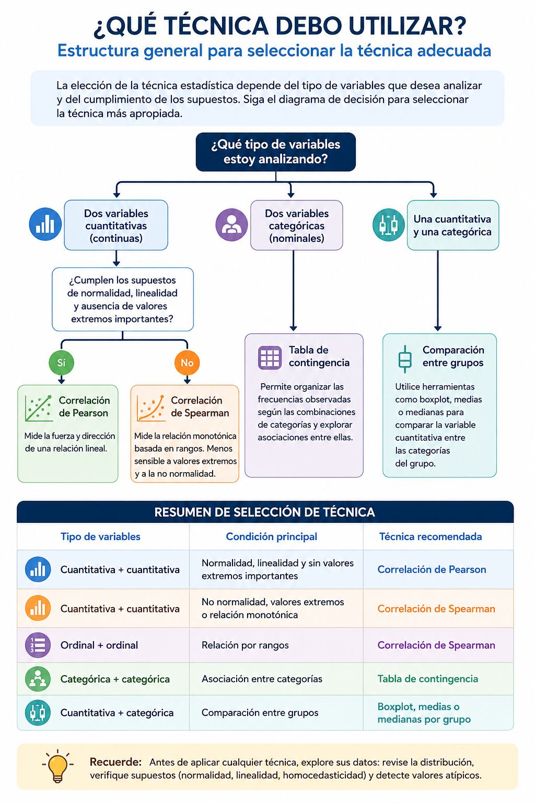
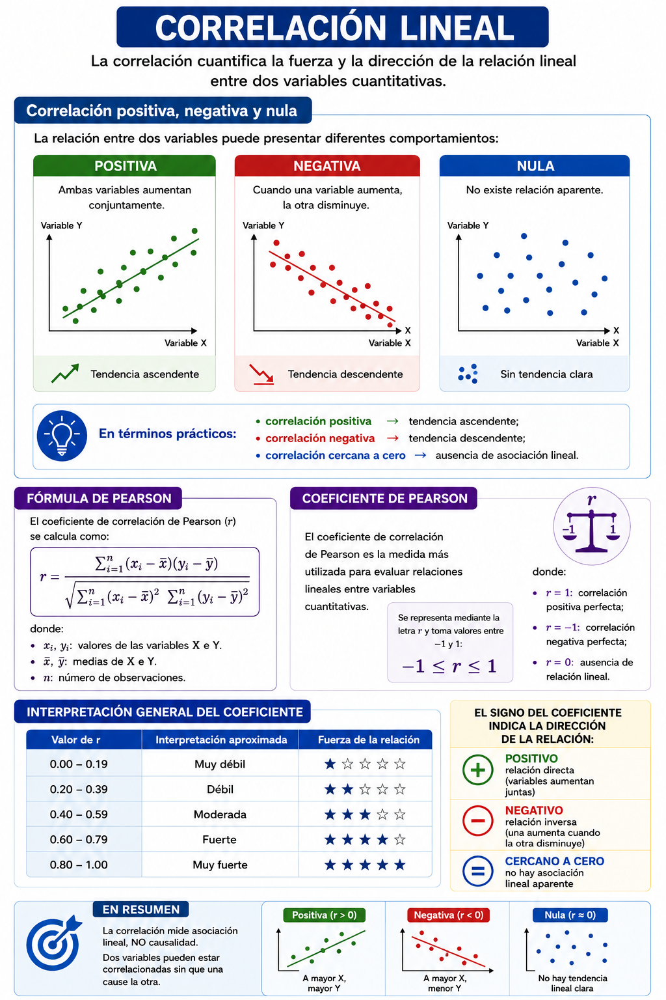
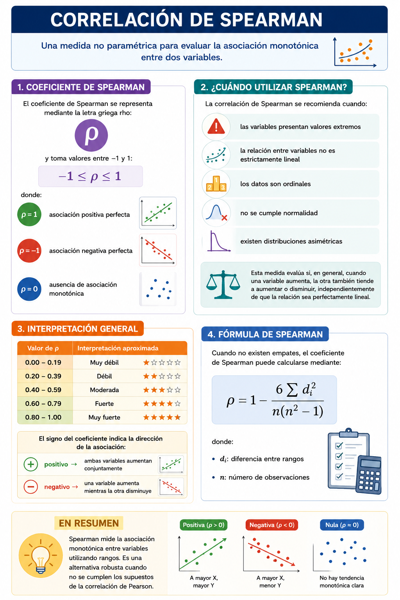
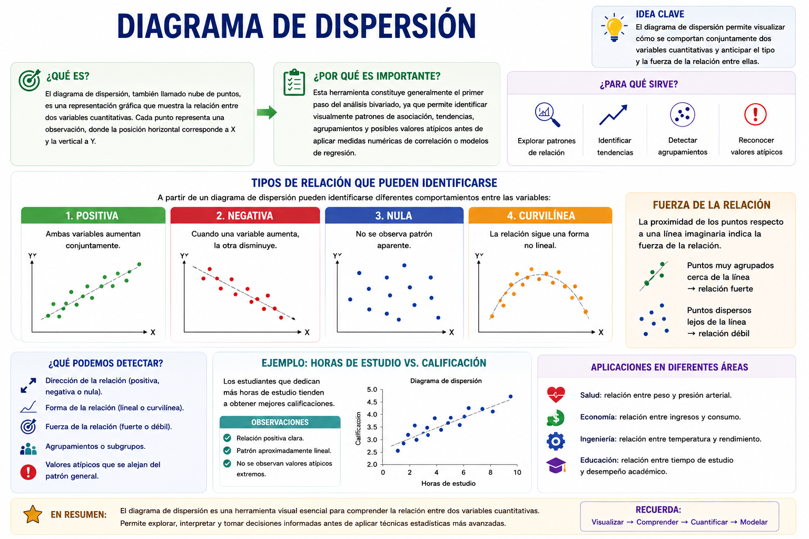
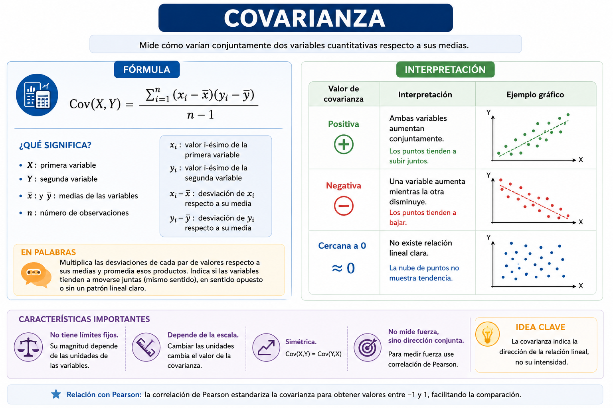

En los capítulos anteriores se estudiaron las características de una
sola variable a la vez, analizando aspectos como la tendencia central,
la dispersión, la posición y la forma de los datos. Sin embargo, en los
problemas reales rara vez las variables actúan de manera aislada. En la
práctica, los fenómenos sociales, económicos, educativos, biológicos y
administrativos suelen depender de la interacción entre múltiples
variables.

Por ejemplo, en educación puede surgir la pregunta de si un mayor número
de horas de estudio se relaciona con mejores calificaciones; en salud,
si existe asociación entre el índice de masa corporal y la presión
arterial; o en economía, si el nivel de ingresos influye sobre el gasto
familiar. Todas estas situaciones requieren estudiar simultáneamente dos
variables y comprender cómo se comportan conjuntamente.

El análisis bivariado corresponde precisamente al conjunto de técnicas
estadísticas utilizadas para explorar, describir, cuantificar e
interpretar la relación entre dos variables medidas sobre las mismas
unidades de análisis. A diferencia del análisis univariado, cuyo
propósito es describir individualmente una variable, el análisis
bivariado busca identificar patrones de asociación, dependencia o
predicción entre variables.

Dependiendo de la naturaleza de las variables involucradas, el análisis
bivariado puede abordar diferentes situaciones: relaciones entre
variables cuantitativas; asociaciones entre variables categóricas;
comparación de una variable cuantitativa entre categorías.

En este capítulo se desarrollan las principales herramientas del
análisis bivariado, incluyendo: diagramas de dispersión, covarianza,
correlación de Pearson, correlación de Spearman, tablas de contingencia,
y regresión lineal simple.

Cada técnica será presentada desde una perspectiva teórica y
posteriormente aplicada mediante ejemplos desarrollados en R utilizando
un mismo conjunto de datos, con el propósito de facilitar la comprensión
progresiva del análisis estadístico y fortalecer el aprendizaje
experiencial. Es importante destacar que el análisis bivariado
constituye la base de técnicas estadísticas más avanzadas, como la
regresión múltiple, el análisis multivariado y los modelos predictivos
utilizados actualmente en ciencia de datos, inteligencia artificial y
analítica aplicada.

## Tipos de análisis bivariado

El tipo de análisis bivariado que puede realizarse depende de la
naturaleza de las variables estudiadas. En estadística, las variables
pueden ser cuantitativas o categóricas, y cada combinación requiere
herramientas específicas de exploración, visualización e interpretación.

Cuando ambas variables son cuantitativas, el interés suele centrarse en
evaluar si existe asociación, dependencia o relación funcional entre
ellas. En estos casos se utilizan herramientas como diagramas de
dispersión, covarianza, correlación y regresión lineal. Por ejemplo,
puede analizarse la relación entre horas de estudio y calificación
final, o entre peso corporal y estatura.

Si ambas variables son categóricas, el objetivo principal consiste en
estudiar asociaciones entre categorías o grupos. Para ello se emplean
tablas de contingencia y medidas de asociación categórica. Un ejemplo
frecuente corresponde al análisis de la relación entre género y nivel de
satisfacción académica.

También existen situaciones donde una variable es cuantitativa y la otra
categórica. En estos casos, el interés radica en comparar el
comportamiento de la variable numérica entre diferentes grupos o
categorías. Por ejemplo, comparar las calificaciones promedio entre
hombres y mujeres, o analizar diferencias salariales entre regiones.

La siguiente tabla resume las principales combinaciones posibles en el
análisis bivariado:

| Tipo de variable 1 | Tipo de variable 2 | Objetivo principal | Técnicas utilizadas |
|------------------|------------------|------------------|------------------|
| Cuantitativa | Cuantitativa | Evaluar asociación o predicción | Correlación, regresión, dispersión |
| Categórica | Categórica | Analizar asociación entre categorías | Tablas de contingencia |
| Cuantitativa | Categórica | Comparar grupos | Boxplot, medias, comparación gráfica |

Comprender el tipo de variables involucradas constituye un paso
fundamental antes de seleccionar cualquier técnica estadística, ya que
una elección incorrecta puede conducir a interpretaciones inadecuadas o
resultados inconsistentes.

En este capítulo se abordarán ejemplos correspondientes a cada una de
estas situaciones, integrando representaciones gráficas, medidas
estadísticas y modelos básicos de análisis bivariado mediante
implementaciones desarrolladas en R.

## Conjunto de datos de trabajo

A lo largo de este capítulo se utilizará un mismo conjunto de datos con
el propósito de ilustrar las diferentes técnicas de análisis bivariado
de manera integrada y progresiva. El uso de un único dataset facilita la
comparación de resultados y permite comprender cómo distintas
herramientas estadísticas pueden analizar una misma realidad desde
perspectivas complementarias.

La base de datos contiene información correspondiente a estudiantes
universitarios e incluye variables cuantitativas y categóricas, entre
ellas:

horas de estudio semanales, calificación final, horas de sueño, y
género.

Estas variables permiten desarrollar ejemplos relacionados con:

relaciones entre variables cuantitativas, asociaciones entre variables
categóricas, y comparación de grupos.

En términos pedagógicos, este enfoque favorece el aprendizaje
experiencial, ya que el estudiante puede observar cómo los conceptos
teóricos se aplican directamente sobre datos reales mediante análisis
reproducibles en R.

## Carga de datos en R

```{r}
#| message: false
#| warning: false

library(readxl)
library(dplyr)

datos <- read_excel(
  "data/bd_antropometricas.xlsx"
)

head(datos)
```

## Exploración inicial de variables

```{r}
#| message: false
#| warning: false

names(datos)

str(datos)
```

## Evaluación de supuestos

### Variables cuantitativas continuas

La correlación de Pearson está diseñada para analizar la relación entre
variables cuantitativas continuas. Estas variables pueden asumir
cualquier valor dentro de un intervalo determinado y suelen corresponder
a procesos de medición, como altura, peso corporal, índice de masa
corporal, temperatura o presión arterial.

A diferencia de las variables cualitativas o discretas, las variables
continuas permiten evaluar cambios graduales en los valores observados,
lo que facilita el estudio de relaciones lineales entre ellas. Por esta
razón, antes de aplicar una correlación de Pearson es importante
verificar que ambas variables correspondan a mediciones cuantitativas
continuas.

En el presente ejemplo, las variables altura (cm) y peso corporal (kg)
cumplen este supuesto, ya que representan mediciones físicas obtenidas
en una escala numérica continua.

### Prueba de normalidad Shapiro-Wilk

La prueba de Shapiro-Wilk permite evaluar si una variable cuantitativa
presenta una distribución aproximadamente normal. En este caso, se
analizan las variables altura y peso corporal de los estudiantes.

La hipótesis nula ($H_0$) establece que los datos siguen una
distribución normal, mientras que la hipótesis alternativa ($H_1$)
plantea que la distribución no es normal.

La decisión se toma a partir del valor $p$:

-   si $p > 0.05$, no se rechaza la normalidad;

-   si $p \leq 0.05$, se concluye que la variable no presenta
    distribución normal.

Estas pruebas son importantes porque muchas técnicas estadísticas
paramétricas, como la correlación de Pearson y la regresión lineal,
asumen normalidad en los datos.

```{r}
library(readxl)
library(dplyr)
library(purrr)

# Cargar base de datos
datos <- read_excel(
  "data/bd_antropometricas.xlsx"
)

# Seleccionar variables numéricas
variables_numericas <- datos %>%
  
  select(where(is.numeric))

# Aplicar Shapiro-Wilk a cada variable
normalidad <- map_df(
  
  names(variables_numericas),
  
  ~{
    
    prueba <- shapiro.test(
      na.omit(variables_numericas[[.x]])
    )
    
    data.frame(
      Variable = .x,
      W = round(prueba$statistic, 4),
      p_value = round(prueba$p.value, 6),
      
      Normalidad = ifelse(
        prueba$p.value > 0.05,
        "Sí presenta normalidad",
        "No presenta normalidad"
      )
    )
  }
)

# Mostrar resultados
normalidad
```

### Independencia de las observaciones

La correlación de Pearson asume que cada observación es independiente de
las demás. Esto significa que el valor registrado para un individuo no
debe influir sobre los valores observados en otro individuo.

Este supuesto depende principalmente del diseño de recolección de los
datos. En estudios donde cada participante aporta una única medición,
como ocurre con la altura y el peso corporal de los estudiantes,
generalmente se considera que existe independencia entre las
observaciones.

### Relación lineal

La correlación de Pearson evalúa exclusivamente relaciones lineales
entre variables. Por ello, antes de calcular el coeficiente de
correlación es recomendable construir un diagrama de dispersión para
verificar que los datos presentan una tendencia aproximadamente recta.

De manera general, una relación lineal puede representarse mediante la
ecuación: $Y=β_0​+β_1​X$

donde:

-   ($Y$) representa la variable dependiente;

-   ($X$) corresponde a la variable independiente;

-   ($β_0$) es el intercepto;

-   ($β_1$) representa la pendiente de la relación.

Cuando la relación es lineal, un incremento en una variable tiende a
estar asociado con un incremento o disminución proporcional en la otra
variable. Si la relación presenta formas curvas o patrones complejos, la
correlación de Pearson puede subestimar la verdadera asociación
existente.

En este ejemplo, la linealidad puede evaluarse visualmente mediante el
diagrama de dispersión entre altura y peso corporal.

```{r}

# Modelo de regresión
modelo <- lm(
  Peso_Kg ~ Altura_cm,
  data = datos
)

# Coeficientes
b0 <- coef(modelo)[1]
b1 <- coef(modelo)[2]

# R²
r2 <- summary(modelo)$r.squared

# Gráfico
plot(
  datos$Altura_cm,
  datos$Peso_Kg,
  main = "Relación entre altura y peso corporal",
  xlab = "Altura (cm)",
  ylab = "Peso (kg)",
  pch = 19,
  col = "blue"
)

# Línea de regresión
abline(
  modelo,
  col = "red",
  lwd = 2
)

# Ecuación y R²
legend(
  "topright",
  legend = c(
    paste0(
      "Peso = ",
      round(b0,2),
      " + ",
      round(b1,2),
      "(Altura)"
    ),
    paste0(
      "R² = ",
      round(r2,3)
    )
  ),
  bty = "n"
)
```

**Interpretación:** La ecuación de regresión obtenida fue:
$\hat{Peso} = \beta_0 + \beta_1(Altura)$, donde $\beta_0$​ representa el
intercepto y $\beta_1$​ el cambio esperado en el peso corporal por cada
centímetro adicional de altura. El coeficiente de determinación ($R^2$)
indica la proporción de variabilidad del peso explicada por la altura.
Valores cercanos a 0 sugieren una relación débil, mientras que valores
cercanos a 1 indican una relación fuerte. De acuerdo con lo anterior el
diagrama de dispersión muestra una **tendencia positiva** entre la
altura y el peso corporal de los estudiantes. En términos generales, a
medida que aumenta la altura, el peso también tiende a incrementarse.

La ecuación de regresión obtenida fue: $\hat{Peso}=-77.62+0.79(Altura)$.
Esto significa que, en promedio, por cada centímetro adicional de
altura, el peso corporal aumenta aproximadamente **0.79 kg**.

El coeficiente de determinación fue: $R^2 = 0.16$, Lo que indica que la
altura explica aproximadamente el **16 % de la variabilidad observada en
el peso corporal**. El 84 % restante se debe a otros factores no
incluidos en el modelo, como sexo, composición corporal, hábitos
alimentarios, actividad física y variabilidad individual.

Visualmente, la nube de puntos presenta una tendencia ascendente
compatible con una relación lineal positiva; sin embargo, la dispersión
de los datos alrededor de la recta es relativamente amplia, lo que
sugiere que la relación entre ambas variables es **débil a moderada**.

### Regresión lineal múltiple

En la regresión lineal simple se analiza la relación entre una variable
respuesta ($Y$) y una única variable explicativa ($X$). Sin embargo,
muchos fenómenos reales dependen simultáneamente de varios factores, por
lo que resulta necesario incorporar múltiples variables predictoras
dentro del modelo. La regresión lineal múltiple puede expresarse como:

$Y=\beta_0+\beta_1X_1+\beta_2X_2+\cdots+\beta_kX_k$

donde:

\- $Y$: variable respuesta o dependiente.\
- $\beta_0$: intercepto del modelo.\
- $X_1, X_2, \ldots, X_k$: variables explicativas o predictoras.\
- $\beta_1, \beta_2, \ldots, \beta_k$: coeficientes asociados a cada
predictor.

En este contexto, el supuesto de linealidad implica que cada variable
explicativa mantiene una relación lineal con la variable respuesta, una
vez controlado el efecto de las demás variables incluidas en el modelo.

Por ejemplo, en la base antropométrica el peso corporal podría modelarse
utilizando simultáneamente variables como la altura, la longitud de la
pierna, la longitud del pie, la longitud de la mano, el índice de masa
corporal (IMC) y el sexo. De esta manera, el modelo permite evaluar el
aporte específico de cada característica sobre el peso corporal,
manteniendo constantes las demás variables.

$Peso=β_0​+β_1​(Altura)+β_2​(LongitudPierna)+β_3​(LongitudPie)+β_4​(LongitudMano)+β_5​(IMC)$

o incluso:

$Altura=β_0+β_1(Longitud  Pierna)+β_2(Longitud  Pie)+β_3(Longitud  Mano)$

### Homocedasticidad

La homocedasticidad indica que la variabilidad de una variable se
mantiene relativamente constante a lo largo de los valores de la otra
variable. Por ejemplo:

-   altura baja → dispersión similar

-   altura media → dispersión similar

-   altura alta → dispersión similar

La homocedasticidad implica que la varianza de los errores es constante
para todos los valores de la variable independiente:

$Var(\varepsilon_i)=\sigma^2$

donde:

$ε_i$: error o residuo de la observación $i$;

$\sigma^2$: varianza constante de los errores.

```{r}

modelo <- lm(
  Peso_Kg ~ Altura_cm,
  data = datos
)

plot(
  fitted(modelo),
  residuals(modelo),
  main = "Residuos vs Valores ajustados",
  xlab = "Valores ajustados",
  ylab = "Residuos",
  pch = 19,
  col = "darkgreen"
)

abline(
  h = 0,
  col = "red",
  lwd = 2
)
```

**Interpretación:** La homocedasticidad hace referencia a la igualdad
aproximada de la variabilidad de los datos a lo largo de los diferentes
valores de la variable independiente. Este supuesto es importante porque
muchas técnicas paramétricas asumen que la dispersión de los errores
permanece constante.

La evaluación visual puede realizarse mediante un gráfico de residuos
frente a los valores ajustados. Cuando los residuos se distribuyen
aleatoriamente alrededor de cero y mantienen una amplitud similar en
todo el rango de observaciones, se considera que existe
homocedasticidad. Por el contrario, si la dispersión aumenta o disminuye
sistemáticamente formando patrones de abanico o embudo, podría existir
heterocedasticidad, indicando que la variabilidad de los errores no es
constante.

### Ausencia de valores atípicos extremos

Los valores atípicos extremos (outliers) pueden afectar
significativamente el coeficiente de correlación de Pearson, generando
estimaciones sesgadas o conclusiones incorrectas sobre la intensidad de
la relación entre las variables.

Para identificar posibles valores atípicos se recomienda utilizar
diagramas de caja (boxplots) o diagramas de dispersión. Si se detectan
observaciones extremas, estas deben revisarse cuidadosamente para
determinar si corresponden a errores de registro o a valores reales de
la población estudiada.

La presencia de valores atípicos no implica necesariamente su
eliminación, pero sí requiere una evaluación crítica antes de realizar
el análisis estadístico.

```{r}

library(readxl)

datos <- read_excel(
  "data/bd_antropometricas.xlsx"
)

boxplot(
  datos$Peso_Kg,
  main = "Distribución del peso corporal",
  ylab = "Peso (kg)",
  col = "lightblue"
)

```

## Estructura general para seleccionar la técnica adecuada

En el análisis bivariado, la selección de la técnica estadística depende
principalmente del tipo de variables que se desean analizar y de los
supuestos que cumplen los datos (@fig-dosvariables). Por esta razón,
antes de aplicar cualquier procedimiento es necesario identificar si las
variables son cuantitativas o categóricas, revisar su distribución,
explorar la forma de la relación y verificar la presencia de valores
atípicos.

{#fig-dosvariables}

## Cuando se cumplen los supuestos

En el caso de las variables **Long_Pierna_cm** y **Long_Pie_cm**
presentan un comportamiento compatible con una distribución normal según
la prueba de Shapiro-Wilk.

Para la variable **Long_Pierna_cm**, se obtuvo un estadístico
$W = 0.9950$ y un valor $p = 0.564763$. Debido a que el valor $p$ es
mayor que $0.05$, no se rechaza la hipótesis nula de normalidad. Esto
indica que la distribución de la longitud de la pierna no presenta
diferencias significativas respecto a una distribución normal.

De manera similar, la variable **Long_Pie_cm** presentó un estadístico
$W = 0.9914$ y un valor $p = 0.134404$. Al ser también mayor que $0.05$,
se concluye que la longitud del pie presenta una distribución
aproximadamente normal.

En términos prácticos, estos resultados sugieren que ambas variables
antropométricas poseen distribuciones relativamente simétricas y sin
desviaciones extremas importantes, lo cual favorece la aplicación de
técnicas estadísticas paramétricas, como: correlación de Pearson,
pruebas t, análisis de regresión lineal e intervalos de confianza
basados en normalidad.

Asimismo, el comportamiento normal de estas variables es coherente con
muchas mediciones biológicas y antropométricas, donde las
características físicas de una población suelen distribuirse alrededor
de un valor promedio central.

### Correlación de Pearson

La correlación es una medida estadística utilizada para cuantificar la
fuerza y la dirección de la relación entre dos variables cuantitativas.
A diferencia del diagrama de dispersión, que permite explorar
visualmente el comportamiento conjunto de las variables, la correlación
resume dicha relación mediante un valor numérico (@fig-correlacion). El
coeficiente de correlación de Pearson se calcula como:

$$
r = \frac{\sum_{i=1}^{n}(x_i-\bar{x})(y_i-\bar{y})}
{\sqrt{\sum_{i=1}^{n}(x_i-\bar{x})^2 \sum_{i=1}^{n}(y_i-\bar{y})^2}}
$$

El coeficiente de correlación indica qué tan estrechamente se relacionan
dos variables y si dicha relación es positiva, negativa o inexistente.

{#fig-correlacion}

#### Ejemplo en R

En el siguiente ejemplo se calcula la correlación entre altura y peso
corporal utilizando la base de datos antropométrica.

```{r}
library(readxl)
library(ggplot2)

# Cargar base de datos
datos <- read_excel(
  "data/bd_antropometricas.xlsx"
)

# Calcular correlación
r <- cor(
  datos$Long_Pierna_cm,
  datos$Long_Pie_cm,
  
  method = "pearson",
  
  use = "complete.obs"
)

# Gráfico
ggplot(
  datos,
  
  aes(
    x = Long_Pierna_cm,
    y = Long_Pie_cm,
    color = Genero
  )
) +
  
  geom_point(
    size = 3,
    alpha = 0.75
  ) +
  
  scale_color_manual(
    values = c(
      "F" = "#D95F02",
      "M" = "#1B9E77"
    )
  ) +
  
  geom_smooth(
    method = "lm",
    se = FALSE,
    color = "black",
    linewidth = 1
  ) +
  
  annotate(
    "text",
    
    x = min(datos$Long_Pierna_cm) + 5,
    
    y = max(datos$Long_Pie_cm) - 5,
    
    label = paste0(
      "r = ",
      round(r, 3)
    ),
    
    size = 5,
    
    fontface = "bold",
    
    color = "black"
  ) +
  
  labs(
    title = "Relación entre Longitud Pierna y Longitud pie",
    
    subtitle = "Diagrama de dispersión y correlación de Pearson",
    
    x = "Longitud Pierna (cm)",
    
    y = "Longitud pie (cm)",
    
    color = "Género",
    
    caption = "Fuente: Base antropométrica Prof. Miguel Pérez"
  ) +
  
  theme_minimal(base_size = 12)
```

**Interpretación:** El diagrama de dispersión permite explorar la
relación entre la longitud de la pierna y la longitud del pie en los
estudiantes, diferenciando las observaciones según el género.
Visualmente, los puntos se encuentran ampliamente dispersos y no
muestran una tendencia lineal clara entre ambas variables.

El **coeficiente de correlación de Pearson** obtenido ($r = 0.012$)
indica una **asociación lineal prácticamente nula entre la longitud de
la pierna y la longitud del pie**. Este valor, al encontrarse muy
cercano a cero, sugiere que el aumento en una de las variables no se
relaciona de manera consistente con cambios en la otra dentro de la
muestra analizada.

Asimismo, la línea de tendencia horizontal observada en el gráfico
confirma la ausencia de una relación lineal significativa. Aunque
existen diferencias naturales entre hombres y mujeres en la distribución
de las observaciones, dichas variaciones no generan un patrón de
asociación fuerte entre las variables estudiadas.

En términos prácticos, estos resultados indican que la longitud de la
pierna no constituye un buen predictor lineal de la longitud del pie en
esta población específica. Este tipo de análisis es importante porque
demuestra que no todas las variables antropométricas presentan
relaciones lineales fuertes, incluso cuando pertenecen a una misma
dimensión biológica.

## Cuando no se cumplen los supuestos

**Interpretación Altura_cm y Peso_Kg:** La prueba de Shapiro-Wilk indica
que ninguna de las dos variables presenta una distribución normal al
nivel de significancia del 5 %.

Para la variable **Altura_cm**, se obtuvo un estadístico $W = 0.9752$ y
un valor $p = 0.000171$. Debido a que el valor $p$ es menor que $0.05$,
se rechaza la hipótesis nula de normalidad, concluyendo que la
distribución de la altura difiere significativamente de una distribución
normal.

De manera similar, para la variable **Peso_Kg**, el estadístico obtenido
fue $W = 0.9040$ con un valor $p = 7.916 \times 10^{-12}$, valor
extremadamente pequeño que también conduce al rechazo de la hipótesis de
normalidad. Esto indica que la distribución del peso corporal presenta
desviaciones importantes respecto a la normalidad.

En términos prácticos, estos resultados sugieren que las variables
antropométricas analizadas no cumplen completamente el supuesto de
normalidad requerido por algunas técnicas paramétricas. Por esta razón,
en determinados contextos podría ser recomendable complementar el
análisis utilizando métodos no paramétricos, como la correlación de
Spearman, especialmente si existen valores extremos o distribuciones
asimétricas.

### Correlación de Spearman

La correlación de Spearman es una medida estadística utilizada para
evaluar la asociación entre dos variables ordinales o cuantitativas
cuando no se cumplen los supuestos de normalidad o linealidad requeridos
por la correlación de Pearson (@fig-corspearman).

A diferencia de Pearson, Spearman no trabaja directamente con los
valores originales de las variables, sino con sus rangos o posiciones
dentro de la distribución. Por esta razón, se considera una medida no
paramétrica de asociación.

{#fig-corspearman}

```{r}
library(readxl)
library(ggplot2)
library(dplyr)

# Cargar base de datos
datos <- read_excel(
  "data/bd_antropometricas.xlsx"
)

# Correlación por género
datos %>%
  
  group_by(Genero) %>%
  
  summarise(
    Correlacion = cor(
      Altura_cm,
      Peso_Kg,
      
      method = "spearman",
      
      use = "complete.obs"
    )
  )

# Diagrama de dispersión por género
ggplot(
  datos,
  
  aes(
    x = Altura_cm,
    y = Peso_Kg,
    color = Genero
  )
) +
  
  geom_point(
    size = 3,
    alpha = 0.75
  ) +
  
  geom_smooth(
    method = "lm",
    se = FALSE,
    linewidth = 1
  ) +
  
  scale_color_manual(
    values = c(
      "F" = "#D95F02",
      "M" = "#1B9E77"
    )
  ) +
  
  labs(
    title = "Relación entre altura y peso corporal según género",
    
    subtitle = "Comparación de patrones de asociación",
    
    x = "Altura (cm)",
    
    y = "Peso (kg)",
    
    color = "Género",
    
    caption = "Fuente: Base antropométrica"
  ) +
  
  theme_minimal(base_size = 12) +
  
  theme(
    plot.title = element_text(
      face = "bold",
      size = 15
    ),
    
    plot.subtitle = element_text(
      size = 11
    )
  )
```

## Otras medidas de asociación

### Diagrama de dispersión

El diagrama de dispersión, también conocido como nube de puntos, es una
representación gráfica utilizada para explorar la relación entre dos
variables cuantitativas. Cada punto del gráfico representa una
observación y su posición en el plano cartesiano depende de los valores
registrados para las variables $X$ y $Y$.

Esta herramienta constituye generalmente el primer paso del análisis
bivariado, ya que permite identificar visualmente patrones de
asociación, tendencias, agrupamientos y posibles valores atípicos antes
de aplicar medidas numéricas de correlación o modelos de regresión
(@fig-dispersion). A partir de un diagrama de dispersión pueden
identificarse diferentes comportamientos entre las variables:

{#fig-dispersion}

#### Ejemplo en R

En el siguiente ejemplo se utiliza la base de datos antropométrica para
analizar la relación entre la estatura de los estudiantes y su peso
corporal. El objetivo consiste en explorar visualmente si existe
asociación entre ambas variables mediante un diagrama de dispersión.

```{r}
library(readxl)
library(ggplot2)

# Cargar base de datos
datos <- read_excel(
  "data/bd_antropometricas.xlsx"
)

# Diagrama de dispersión
ggplot(
  datos,
  
  aes(
    x = Altura_cm,
    y = Peso_Kg,
    color = Genero
  )
) +
  
  geom_point(
    size = 3,
    alpha = 0.75
  ) +
  
  scale_color_manual(
    values = c(
      "F" = "#D95F02",
      "M" = "#1B9E77"
    )
  ) +
  
  labs(
    title = "Relación entre altura y peso corporal",
    
    subtitle = "Distribución según género",
    
    x = "Altura (cm)",
    
    y = "Peso (kg)",
    
    color = "Género",
    
    caption = "Fuente: Base antropométrica prof. Miguel Pérez"
  ) +
  
  theme_minimal(base_size = 12) +
  
  theme(
    plot.title = element_text(
      face = "bold",
      size = 15
    ),
    
    plot.subtitle = element_text(
      size = 11
    ),
    
    legend.position = "right"
  )

```

**Interpretación:** El diagrama de dispersión permite explorar
visualmente la relación entre la altura y el peso corporal de los
estudiantes, diferenciando las observaciones según el género. En
general, se observa una tendencia positiva entre ambas variables,
indicando que a mayores valores de altura tienden a presentarse mayores
valores de peso corporal.

La diferenciación por color facilita identificar posibles agrupamientos
entre hombres y mujeres, evidenciando patrones distintos en la
distribución de las observaciones. Este tipo de visualización resulta
útil para detectar comportamientos particulares dentro de subgrupos
poblacionales y constituye una herramienta exploratoria fundamental
antes de aplicar medidas numéricas de asociación o modelos estadísticos
más complejos.

::: callout-warning
El **diagrama de dispersión** es principalmente una herramienta de
análisis exploratorio y visualización bivariada. NO es todavía una
correlación numérica.
:::

### Covarianza

La covarianza es una medida estadística utilizada para evaluar cómo
varían conjuntamente dos variables cuantitativas respecto a sus medias.
Esta medida permite identificar si ambas variables tienden a aumentar
simultáneamente, disminuir conjuntamente o comportarse de manera
independiente (@fig-covarianza).

La covarianza constituye uno de los fundamentos matemáticos de la
correlación lineal y de la regresión.

{#fig-covarianza}

#### Ejemplo en R

```{r}
library(readxl)

# Cargar base de datos
datos <- read_excel(
  "data/bd_antropometricas.xlsx"
)

# Covarianza
cov(
  datos$Long_Pierna_cm,
  datos$Long_Pie_cm,
  
  use = "complete.obs"
)
```

**Interpretación:** La covarianza calculada ($r = 0.062$) entre la
longitud de la pierna y la longitud del pie presenta un valor cercano a
cero, indicando que ambas variables no muestran una variación conjunta
importante dentro de la muestra analizada.

Este resultado coincide con el **análisis de correlación de Pearson**
previamente realizado ($r = 0.012$), donde también se evidenció una
relación lineal prácticamente nula entre las variables. En términos
prácticos, los cambios en la longitud de la pierna no se asocian de
manera consistente con cambios en la longitud del pie en los estudiantes
evaluados.

Asimismo, este ejemplo permite comprender que no todas las variables
antropométricas presentan asociaciones lineales fuertes, incluso cuando
pertenecen a dimensiones corporales relacionadas.

### Tablas de contingencia

Las tablas de contingencia son herramientas estadísticas utilizadas para
resumir y analizar la relación entre dos variables categóricas. Estas
tablas permiten organizar las frecuencias observadas según las
diferentes combinaciones de categorías presentes en las variables
estudiadas.

También son conocidas como: tablas cruzadas, tablas de doble entrada o
tablas de asociación.

Su principal objetivo consiste en identificar posibles patrones de
relación o dependencia entre categorías.

#### Estructura general

Una tabla de contingencia distribuye las observaciones en filas y
columnas:

|              | Categoría B1 | Categoría B2 | Total        |
|--------------|--------------|--------------|--------------|
| Categoría A1 | $f_{11}$     | $f_{12}$     | $f_{1\cdot}$ |
| Categoría A2 | $f_{21}$     | $f_{22}$     | $f_{2\cdot}$ |
| Total        | $f_{\cdot1}$ | $f_{\cdot2}$ | $n$          |

donde:

-   las filas representan categorías de una variable;
-   las columnas representan categorías de la otra variable;
-   cada celda contiene la frecuencia observada.

### Interpretación

Las tablas de contingencia permiten comparar frecuencias entre grupos;
identificar asociaciones entre categorías; calcular porcentajes
conjuntos; analizar patrones poblacionales; servir como base para
pruebas como Chi-cuadrado. Cuando las proporciones observadas son
similares entre categorías, puede inferirse independencia entre las
variables. En cambio, diferencias importantes sugieren posibles
asociaciones.

### Ejercicio contextual

En estudios educativos puede analizarse la relación entre género y
aprobación académica; modalidad de estudio y rendimiento o nivel
socioeconómico y acceso tecnológico. En salud tabaquismo y enfermedad;
clasificación nutricional y actividad física.

### Ejemplo en R

En el siguiente ejemplo se construye una tabla de contingencia entre
género y grupo académico utilizando la base antropométrica.

```{r}
library(readxl)
library(dplyr)
library(janitor)
library(knitr)
library(kableExtra)

# Cargar base de datos
datos <- read_excel(
  "data/bd_antropometricas.xlsx"
)

#====================================================
# 1. Género vs Talla dicotómica
#====================================================

datos %>%
  
  tabyl(
    Genero,
    Talla_Dicotica
  ) %>%
  
  adorn_totals(c("row", "col")) %>%
  
  adorn_percentages("row") %>%
  
  adorn_pct_formatting(digits = 1) %>%
  
  adorn_ns(position = "front") %>%
  
  kable(
    caption = "Tabla de contingencia: Género y talla dicotómica",
    align = "c"
  ) %>%
  
  kable_styling(
    full_width = FALSE,
    bootstrap_options = c(
      "striped",
      "hover",
      "condensed"
    )
  )

#====================================================
# 2. Género vs IMC dicotómico
#====================================================

datos %>%
  
  tabyl(
    Genero,
    IMC_Dicotico
  ) %>%
  
  adorn_totals(c("row", "col")) %>%
  
  adorn_percentages("row") %>%
  
  adorn_pct_formatting(digits = 1) %>%
  
  adorn_ns(position = "front") %>%
  
  kable(
    caption = "Tabla de contingencia: Género e IMC dicotómico",
    align = "c"
  ) %>%
  
  kable_styling(
    full_width = FALSE,
    bootstrap_options = c(
      "striped",
      "hover",
      "condensed"
    )
  )

#====================================================
# 3. Género vs Tamaño de mano
#====================================================

datos %>%
  
  tabyl(
    Genero,
    Mano_Dicotica
  ) %>%
  
  adorn_totals(c("row", "col")) %>%
  
  adorn_percentages("row") %>%
  
  adorn_pct_formatting(digits = 1) %>%
  
  adorn_ns(position = "front") %>%
  
  kable(
    caption = "Tabla de contingencia: Género y tamaño de mano",
    align = "c"
  ) %>%
  
  kable_styling(
    full_width = FALSE,
    bootstrap_options = c(
      "striped",
      "hover",
      "condensed"
    )
  )
```

**Interpretación:** En términos generales, el 88.9 % de las mujeres se
clasifican dentro del rango normal de IMC y el 11.1 % presenta sobrepeso
u obesidad. En contraste, entre los hombres solo el 48.1 % presenta IMC
normal, mientras que el 51.9 % se ubica en la categoría de
sobrepeso-obesidad. Considerando el total de la muestra, el 80.8 % de
los estudiantes presenta un IMC normal y el 19.2 % presenta sobrepeso u
obesidad.

Estos resultados sugieren una posible asociación entre el género y la
clasificación del IMC, evidenciando una mayor proporción de
sobrepeso-obesidad en los hombres respecto a las mujeres dentro de la
población analizada. Las tablas de contingencia permiten identificar
este tipo de patrones descriptivos y constituyen la base para
posteriores análisis inferenciales, como la prueba Chi-cuadrado de
independencia.

## Integración y aplicación

### Estructura general para seleccionar la técnica adecuada

### Laboratorio experiencial

**¿Existe relación entre la altura y el peso corporal?**

**Situación problema:** Un grupo de estudiantes de fisioterapia desea
analizar si la altura corporal se relaciona con el peso de los
estudiantes universitarios. Para ello, se recolectó información
antropométrica de hombres y mujeres de diferentes semestres académicos.

**Objetivo del análisis**

Determinar: si existe relación entre altura y peso; la dirección de la
relación; la fuerza de la asociación y si el género modifica visualmente
el comportamiento de los datos.

### Actividades del estudiante

**Parte 1 — Exploración visual**

**Preguntas**

¿Qué tipo de relación observa en el diagrama? positiva, negativa, nula,
urvilínea.\
¿La relación parece fuerte o débil?\
¿Existen valores atípicos?\
¿Se observan diferencias entre hombres y mujeres?

**Parte 2 — Correlación**

Calcule: correlación de Pearson y correlación de Spearman.

**Preguntas**

¿Los coeficientes son similares?\
¿Cuál considera más apropiado según la distribución de los datos?\
¿Puede afirmarse causalidad?

**Parte 3 — Interpretación aplicada**

Un investigador afirma que “Los estudiantes más altos necesariamente
pesan más”.

**Preguntas críticas**

¿La correlación encontrada permite afirmar eso?

¿Qué limitaciones tiene el análisis?

¿Qué otras variables podrían influir?
