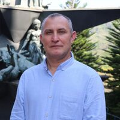

{fig-align="left" width="100"}

**Francisco Javier León:** Bacteriólogo y laboratorista clínico, magíster en estadística aplicada, magíster en ciencias básicas biomédicas y especialista en educación con nuevas tecnologías. Desde 2007, está relacionado con la Universidad de Santander (UDES), en la que ha trabajado como profesor en la Facultad de Ciencias Exactas, Naturales y Agropecuarias. Actualmente, trabaja como Coordinador de Analítica Académica en Planeación Institucional. Es un miembro de CIBAS y un investigador junior premiado por MinCiencias en la convocatoria 957 del año 2024.

{fig-align="left" width="100"}

**Miguel Oswaldo Pérez Pulido:** Licenciado en matemáticas y magíster en estadística. Actualmente se desempeña como Director de Planeación Institucional. Está vinculado a la Universidad de Santander (UDES) desde 2011, donde ha sido docente en programas de pregrado y posgrado de la Facultad de Ciencias Exactas, Naturales y Agropecuarias. Es investigador asociado reconocido por MinCiencias en la convocatoria 957 de 2024 y miembro del grupo de investigación CIBAS.

{fig-align="left" width="100"}

**Leonardo Andrés Pinto Guarguati:** Economista, especialista en Evaluación y Gerencia de Proyectos, y estudiante de la Maestría en Evaluación y Gerencia de Proyectos (Universidad Industrial de Santander). Con experiencia en docencia universitaria, análisis de mercados y coordinación de proyectos de Ciencia, Tecnología e innovación - CTeI.
